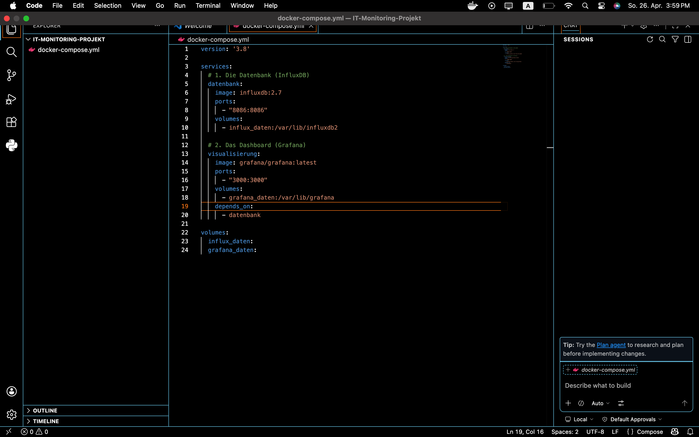
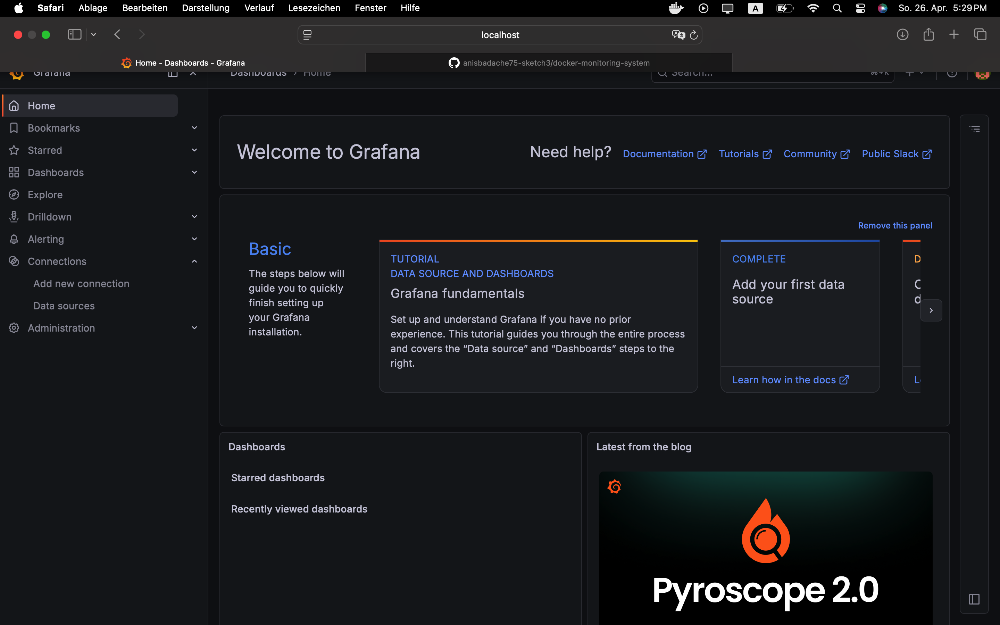
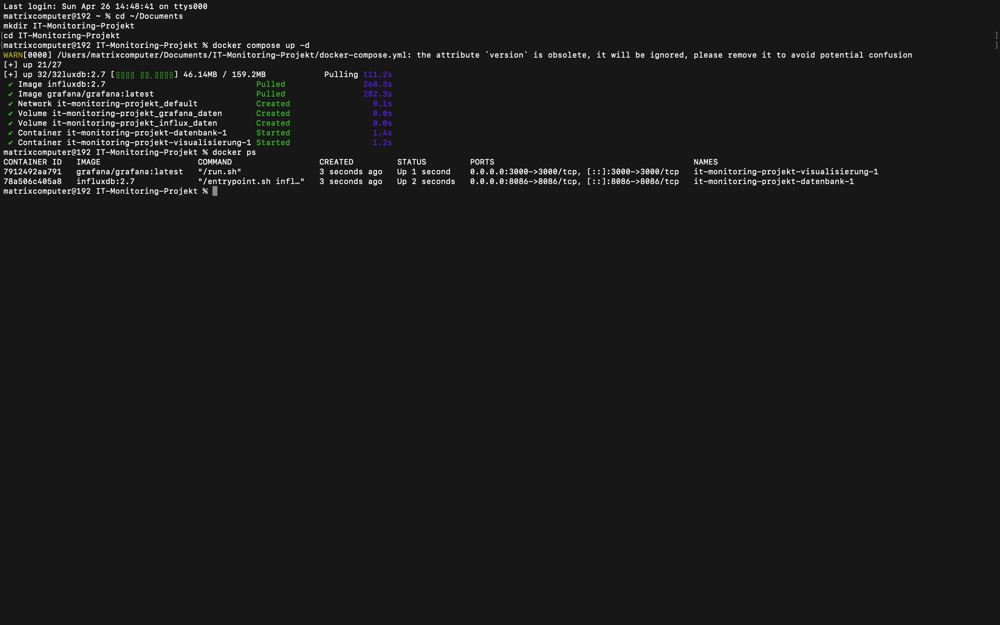

# IT-Monitoring System mit Docker

### Dashboard View

### Welcome Screen

### Terminal Status

# IT-Monitoring mit Docker

### 🚀 Was ist das?
Ich habe ein System gebaut. Es zeigt: Wie schnell ist mein Computer? Wie viel RAM benutzt er? 
Ich möchte **Fachinformatiker** werden. Dieses Projekt hilft mir beim Lernen.

### 🛠 Was habe ich benutzt?
* **Docker:** Damit laufen meine Programme.
* **InfluxDB:** Hier speichere ich die Daten.
* **Grafana:** Hier sehe ich bunte Grafiken.

### 📈 Was kann ich jetzt?
* Ich kann Docker auf dem Mac benutzen.
* Ich kann Datenbanken verbinden.
* Ich kann Technik einfach erklären.

---
**Ich lerne gerne neue Sachen am Computer. Das ist mein Hobby und mein Ziel.**
